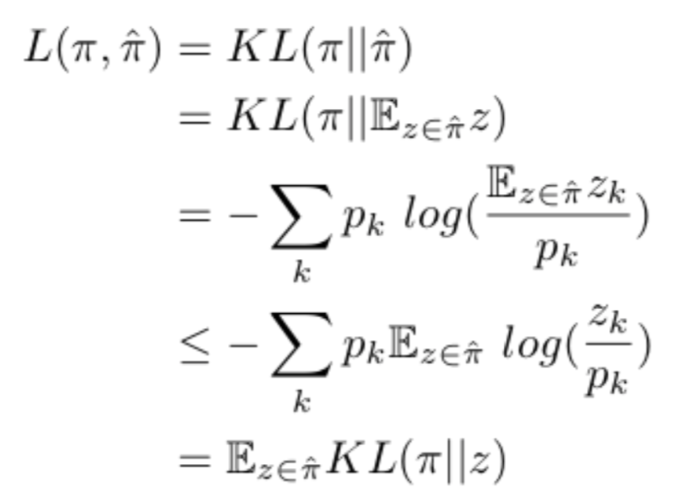
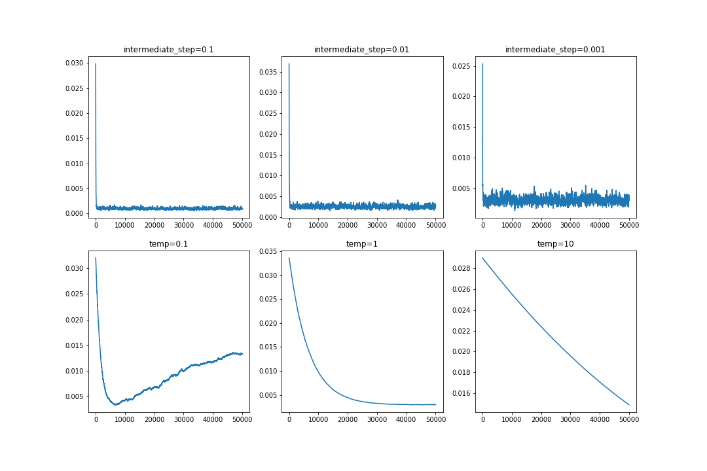

## Intermediate Loss Sampling
### Related Work
I propose a novel approach, leveraging an intermediate loss function to differentiate through a categorical draw. There exists a long history of using policy gradient techniques where only the policy network gradients are utilized, but in the last couple of years approaches like the Gumbel Softmax has surfaced. Gumbel Softmax attempts to model categorical variables through a reparametrization trick and uses softmax to approximate the argmax operator, which in result is completely differentiable. The gumbell softmax is parametrized by a temperature hyperparameter, T. at T=0, this approximation is equivalent to a draw from the categorical distribution but the gradient is undefined. As T increases, the derivative is more defined, but the sample becomes more and more smooth. This give and take is the primary issue with this approach.   

### Construction
As a forward pass, it is simply the draw itself with no approximations. For a backpass, we define an intermediate loss function KL(pi_D || pi) where pi_D is a single SGD step from solving which distribution best approximates our end objective.

### Toy Problems
#### Toy Example 1:
Given a random discrete categorical distribution I solve for minimizing Expectation(KL(pi_true||pi_model)) by only having access to singular draws at the time. Given that KL divergence is greater than 0 I show this is a suitable test by showing its an upper bound of our true object and creating a squeeze-based optimization problem. The simple proof:  

  

 

For my experiemnts I use temperatures of .1, 1, 10 for the gumbel softmax and stepsizes of .1,.01,.001 for the intermediate loss sampling. 

  

 

The above shows that in all settings the intermediate loss approach works just as well if not better and converges almost immediately. Note that the noise in the IL settings is because of the inherent variance of using single-step draws, which gumbel-softmax wont have as it can produce smoother outputs than pure one-hot encodings.
